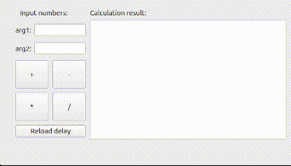

# Simple Calculator QT
## Task

Написать модуль, выполняющий вычисления. Достаточно будет сложения, вычитания, умножения и целочисленного деления, соответственно для целых чисел.
Модуль должен работать в отдельном потоке и получать данные и отдавать результат вычислений через систему qt сигналов и слотов.
Для симуляции нагруженных вычислений, сделать задержку при подсчете (Должна читаться из конфигурационного файла)
Для взаимодействия с модулем простой графический интерфейс на QWidget.

## The main points of implementation

* Класс MainWindow - класс, отвечающий за работу с графикой;
* Класс Calculator - класс, выполняющий вычисления;

Общение  между классами - система сигналов и слотов QT. 
Запрос на вычисления и ответ с результатами отправляется в качестве указателей
на объекты структур TaskRequest и TaskResponse соотвественно.

Конфигурационный файл с числовым значением задержки в миллисекундах
представлен в json формате и должен находиться в корневой директории проекта.
Если файл не найден или некорректен - значение задержки по умолчанию задается 0 мс.
В течении работы программы пользователь может поменять содержимое файла и
 перезагрузить значение задержки(соотвествующая кнопка в интерфейсе).

Тесты написаны с помощью QtTest.

Система сборки: qmake.

## To run

    git clone git@github.com:MikhailCherepanovD/SimpleCalculatorQT.git
    cd SimpleCalculatorQT
    mkdir -p build/Desktop-Debug
    cd build/Desktop-Debug
    qmake6 ../../SimpleCalculator.pro
    make
    ./SimpleCalculator

## To run tests
    cd tests
    mkdir -p build/Desktop-Debug
    cd build/Desktop-Debug
    qmake6 ../../SimpleCalculatorTest.pro
    make
    ./SimpleCalculatorTest
### Expected tests results:
    CalculatorTest: 
    Totals: 24 passed, 0 failed, 0 skipped, 0 blacklisted;

    MainWindowTest:
    Totals: 3 passed, 0 failed, 0 skipped, 0 blacklisted;

## How it works:

